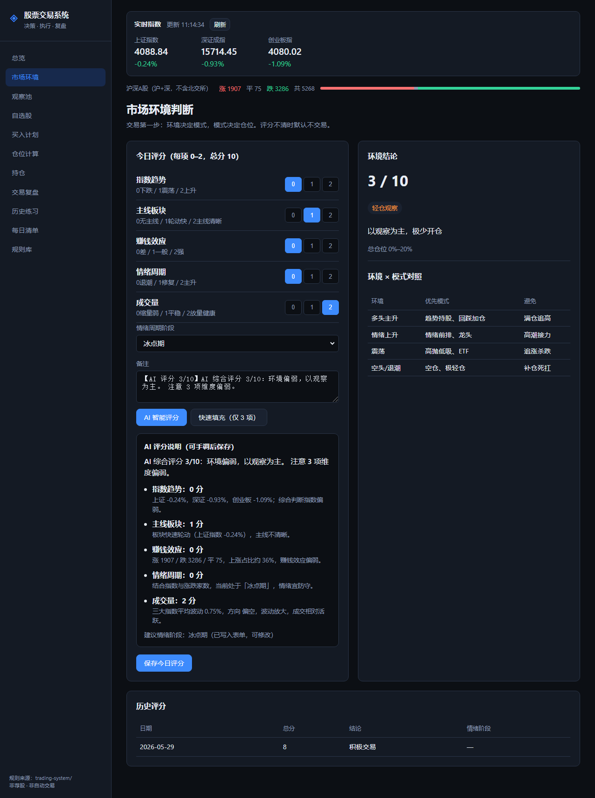
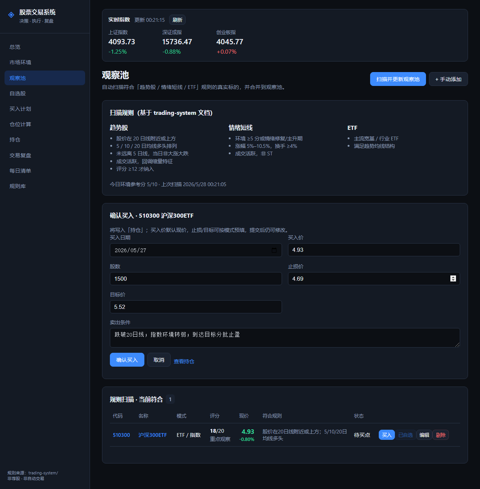
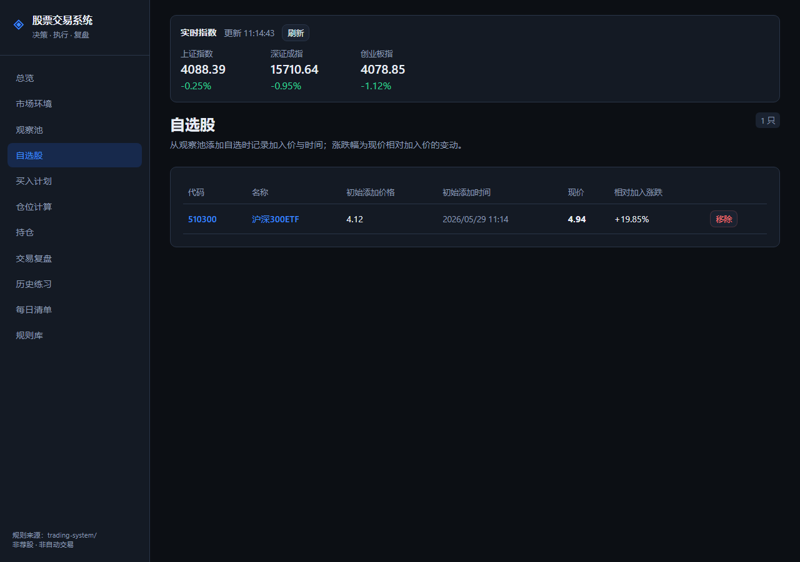
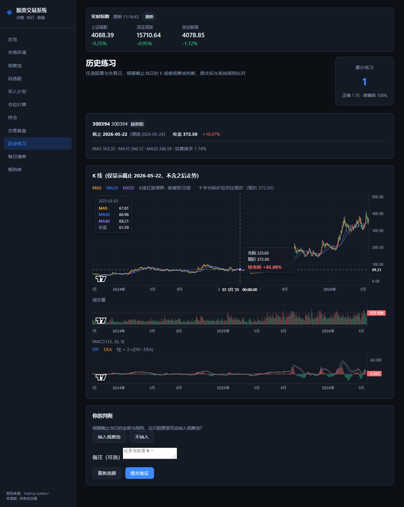
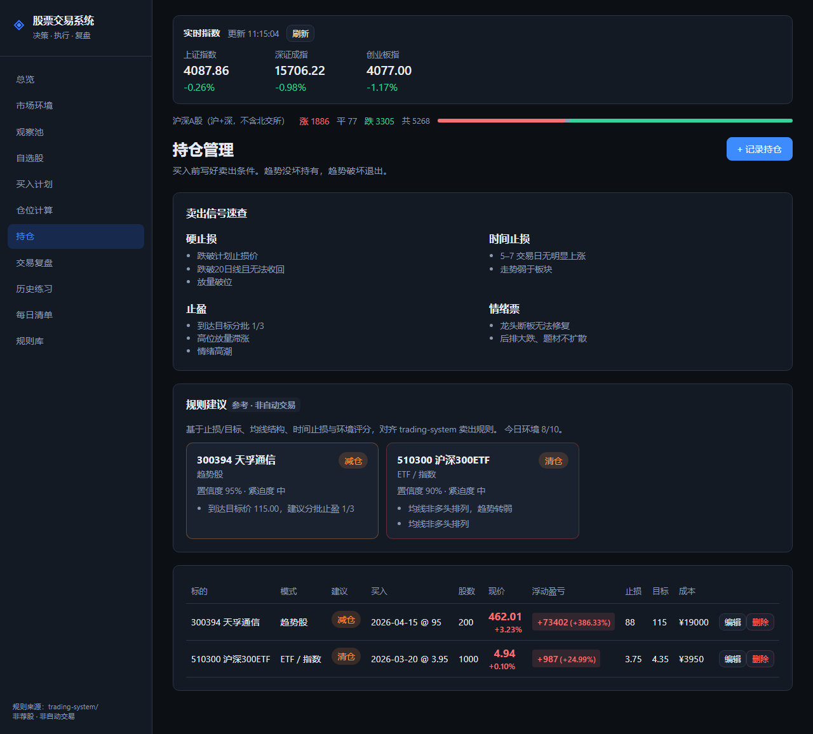

# 股票交易系统

> **决策 · 执行 · 复盘**  
> 一套帮你「先想清楚、再动手」的 A 股交易工作流工具。

---

## 这是什么？

很多人炒股的问题，不是看不懂 K 线，而是：

- 不知道今天**该不该交易**
- 买的时候**没有计划**，卖的时候**靠情绪**
- 亏了不知道错在规则还是运气，赚了也不知道怎么重复

**股票交易系统**把成熟的交易经验，整理成一条可每天执行的流程：  
先看环境 → 再选股 → 写计划 → 算仓位 → 持仓管理 → 复盘迭代。

配套的 **本地 Web 工具**（`trading-app`）负责：

- 展示**真实行情**（指数、个股现价，涨红跌绿）
- **AI 智能评分**市场环境（五维 0–2 分 + 说明，可手调后保存）
- 按规则**扫描观察池**，支持**一键买入**写入持仓
- **自选股**独立跟踪，记录加入时价格
- 填写**买入计划**与检查表
- 查看个股 **K 线、均线、成交量、MACD**；十字光标**对比现价涨跌幅**（均线数值左上角浮层显示，不被 K 线遮挡）
- **历史练习**：任选股票与交易日，根据截止当日的 K 线做观察池判断，提交后与规则引擎自动比对
- **持仓规则建议**：对每只持仓给出加仓 / 减仓 / 持有 / 清仓参考（对齐卖出规则，非自动交易）
- **数据备份**：总览页一键导出 / 导入 JSON，换设备或清缓存后可恢复计划、持仓与复盘
- 记录持仓与复盘

**它不是荐股软件，也不会替你下单。**  
它只是让你像职业交易者一样，用清单和规则约束自己。

---

## 不是什么？

| | 本系统 | 常见误区 |
|---|--------|----------|
| 定位 | 交易决策与执行辅助 | 自动炒股、喊单群 |
| 输出 | 观察池 + 计划 + 复盘 | 「明天必涨」代码 |
| 下单 | 你在券商 App 自己操作 | 系统代下单 |
| 数据 | 行情仅供参考 | 保证盈利 |

---

## 适合谁？

- 想做**趋势**或**波段**，希望有明确买卖依据的人  
- 容易**追高、死扛、临盘改主意**的人  
- 愿意**每天花 15～30 分钟**做盘前计划与盘后复盘的人  
- 上班族：可用 **ETF 模式**、观察池 + 计划，不必盯盘  

不太适合：追求全自动量化、或只想听消息跟单的人。

---

## 核心理念（7 条）

1. **先判断市场环境**，再决定今天做哪种模式、用多大仓位。  
2. **先写交易计划**，再决定是否下单。  
3. 只做能说清：**买点、止损、目标、仓位**的交易。  
4. 不追高、不满仓、不在亏损中盲目补仓。  
5. **盈利加仓，亏损不加仓。**  
6. 趋势没坏就持有，趋势破坏就退出。  
7. **每笔交易都要复盘**，系统靠复盘变好。

更完整的规则说明见目录 [`trading-system/`](trading-system/)（Markdown 规则库）。

---

## 一笔交易怎么走？

```
市场环境判断 → 选择模式 → 建立观察池 → 等待买点
      ↓
交易前检查 → 仓位计算 → 执行买入 → 持仓管理
      ↓
卖出 / 止损 → 复盘归档 → 优化规则
```

**三种主要模式**

| 模式 | 适用场景 | 要点 |
|------|----------|------|
| 趋势股 | 多头、震荡偏强 | 20 日线附近、均线多头、回踩不破 |
| 情绪短线 | 情绪修复 / 主升 | 主线前排、分歧转一致，严格止损 |
| ETF | 稳健、上班族 | 低位分批，牛市高潮逐步退出 |

---

## 功能一览

### 今日总览

大盘指数、涨跌家数、观察池与持仓入口，一眼看清今天从哪开始。支持 **导出 / 导入 JSON 备份**（计划、持仓、复盘、练习记录等）。

<p align="center">
  
</p>

---

### 市场环境 · AI 智能评分

五维手动评分（指数趋势、主线板块、赚钱效应、情绪周期、成交量），也可点击 **「AI 智能评分」**：基于实时指数与涨跌家数自动打分，并展示各维度说明；确认后可手调再保存。

<p align="center">
  
</p>

---

### 观察池 · 规则扫描与一键买入

自动扫描符合趋势 / 情绪 / ETF 规则的标的；列表展示评分、现价（涨红跌绿）、符合规则说明。每行支持 **买入**（写入持仓）、**加自选**、编辑、剔除。

<p align="center">
  
</p>

点击 **买入** 后弹出确认面板（默认带入现价、建议股数、止损/目标），确认即记入持仓：

<p align="center">
  
</p>

点击代码或名称进入个股详情。

---

### 自选股

与观察池独立，记录加入时的价格与时间，方便长期跟踪自选标的。

<p align="center">
  
</p>

---

### 个股详情 · 醒目报价与 K 线对比

大号现价与涨跌徽章（涨红跌绿）；日 / 周 / 月 K 线，MA5 / MA20 / MA30，成交量与 MACD。鼠标移动十字光标时，显示**光标价位相对现价的涨跌幅**。

<p align="center">
  
</p>

---

### 买入计划 · 检查表

下单前必须填写：买入价、止损、目标、仓位、加仓/卖出条件，并逐项勾选检查表（环境、模式、盈亏比、是否愿意认错等）。  
**任意一项不确定 → 降仓或不做。**

---

### 仓位计算

根据总资金与「单笔最大可亏比例」，结合止损幅度，算出**最多能买多少**。  
避免凭感觉重仓。

---

### 历史练习

任选股票与历史交易日，K 线**只显示截止所选日期**（不泄露之后走势）。根据当日走势判断「是否纳入观察池」，提交后与系统规则引擎比对对错，并记录练习历史与准确率。

<p align="center">
  
</p>

支持按名称或代码搜索、假设环境总分、可选换手率；练习日期可选约 3 年内任意交易日。

---

### 持仓 · 规则建议

记录持仓并实时查看浮动盈亏（可从观察池一键买入写入）。系统根据**止损/目标、均线结构、时间止损、环境评分**等规则，为每只持仓给出 **加仓 / 减仓 / 持有 / 清仓** 建议及理由（参考用，不会自动下单）。

<p align="center">
  
</p>

---

### 交易复盘

每笔平仓后归类为：

- 系统内盈利 / 系统内亏损  
- 系统外盈利（侥幸）/ 系统外亏损（违规）  

统计胜率、盈亏比、违规次数，用来改规则而不是改回忆。

---

### 每日清单

盘前、买入前、持仓中、卖出前、盘后各一份勾选清单，防止临盘冲动。

---

### 数据备份与恢复

所有交易记录在浏览器 **localStorage**，不会上传到服务器。在 **今日总览** 底部可：

- **导出备份**：下载 JSON 文件（含观察池、持仓、计划、复盘、练习记录等）
- **导入备份**：选择此前导出的 JSON 恢复（会覆盖当前本地数据）

换电脑、清缓存或重装浏览器前，建议先导出一份备份。

---

## 技术说明（开发者）

`trading-app` 为 **React + Vite** 单页应用，主要特点：

| 方面 | 说明 |
|------|------|
| 行情 | 东财为主、腾讯 `qt` 备用；开发环境经 Vite 代理，Pages 直连公开接口 |
| K 线 | 腾讯前复权，本地 TTL 缓存 + 并发去重；图表懒加载、增量更新 |
| 状态 | 计划/持仓等存 `localStorage`；行情与 App 数据分 store 细粒度订阅，减少无关重渲染 |
| 路由 | 页面按需懒加载；悬停侧栏可预加载对应 chunk |
| 扫描 | 观察池规则扫描并行拉取列表与 K 线，支持趋势 / 情绪 / ETF 三类 |

本地开发详见 [`trading-app/README.md`](trading-app/README.md)。

---

## 仓库结构

```
stock/
├── assets/             # README 配图（提交到 Git 后 GitHub 会直接显示）
│   ├── dashboard.png
│   ├── market-env-ai.png
│   ├── watchlist.png
│   ├── watchlist-buy.png       # 观察池一键买入
│   ├── favorites.png
│   ├── stock-detail.png
│   ├── practice.png          # 历史练习
│   └── holdings-advice.png   # 持仓规则建议
├── trading-system/     # 交易规则文档（方法论，可单独阅读）
├── trading-app/        # 本地 Web 工具（交互界面）
└── docs/screenshots/   # 配图备份（与 assets/ 同步）
```

- 想**学方法**：从 [`trading-system/README.md`](trading-system/README.md) 读起。  
- 想**每天用**：进入 `trading-app` 启动界面（见下）。

---

## 快速开始

1. 进入工具目录并安装依赖（首次）  
2. 启动本地服务  
3. 浏览器打开页面，从「市场环境」**AI 智能评分**开始，再「扫描观察池」

具体命令见 [`trading-app/README.md`](trading-app/README.md)（仅启动说明，偏操作步骤）。

---

## 部署到 GitHub Pages（GitHub Actions）

仓库已包含 [`.github/workflows/deploy-pages.yml`](.github/workflows/deploy-pages.yml)，推送 `main` 后会自动构建 `trading-app` 并发布静态站点。

### 一次性设置（在 GitHub 网页操作）

1. 打开仓库 **Settings → Pages**
2. **Build and deployment → Source** 选择 **GitHub Actions**（不要选 Deploy from a branch）
3. 保存后，推送一次 `main`，或到 **Actions** 页手动运行 **Deploy to GitHub Pages**

### 访问地址

部署成功后（约 1～3 分钟）：

**https://tensorcode666.github.io/stock/**

（若仓库改名，路径中的 `stock` 需与仓库名一致，并同步修改 workflow 里的 `VITE_BASE`。）

### 本地模拟 Pages 构建

```bash
cd trading-app
npm ci
VITE_BASE=/stock/ npm run build
npm run preview -- --port 4173
```

浏览器打开 http://localhost:4173/stock/

### 说明

- 线上环境**没有** Vite 开发代理，行情走代码里配置的公开接口（东方财富 / 腾讯）；若浏览器 CORS 限制导致部分接口失败，属静态站点常见情况，本地 `npm run dev` 仍可用代理。
- 交易数据仍在浏览器 **localStorage**，换设备或清缓存会丢失，请用总览页 **导出备份** 定期保存。

重新生成 README 配图（可选）：

```bash
cd trading-app
npm run dev -- --port 5174
# 另开终端
npm run capture-screenshots
# 或指定地址：APP_URL=http://localhost:5173 node scripts/capture-readme-screenshots.mjs
```

截图会同时写入 `assets/` 与 `docs/screenshots/`。当前包含：总览、市场环境、观察池、自选股、个股详情、**历史练习**、**持仓建议**。

---

## 免责声明

- 本仓库仅供**学习与交流**，不构成任何投资建议。  
- 行情数据来自公开接口，可能存在延迟或误差，请以券商终端为准。  
- 股市有风险，入市需谨慎；请对自己的交易负责。

---

如果这套流程对你有用，欢迎 Star；也欢迎按 `trading-system` 里的规则继续迭代你自己的版本。
