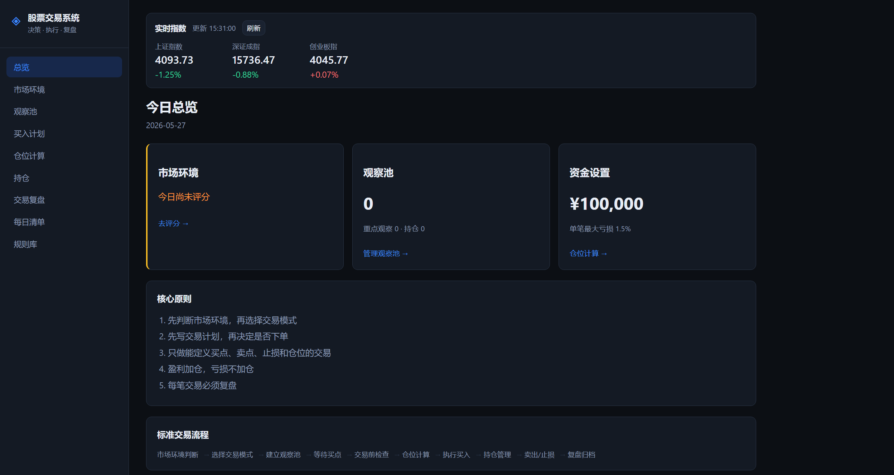
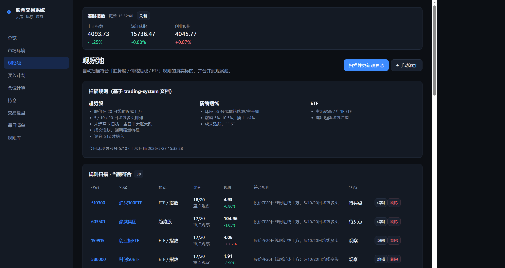
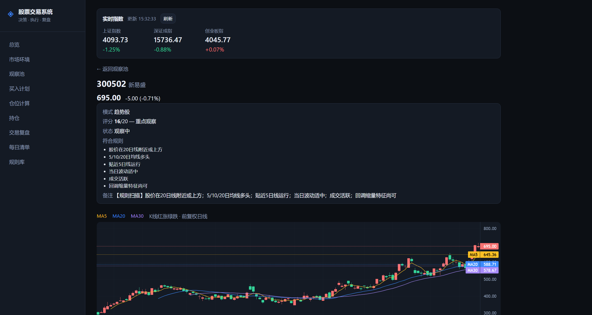

# 股票交易系统

> **决策 · 执行 · 复盘**  
> 一套帮你「先想清楚、再动手」的 A 股交易工作流工具。

---

## 这是什么？

很多人炒股的问题，不是看不懂 K 线，而是：

- 不知道今天**该不该交易**
- 买的时候**没有计划**，卖的时候**靠情绪**
- 亏了不知道错在规则还是运气，赚了也不知道怎么重复

**股票交易系统**把成熟的交易经验，整理成一条可每天执行的流程：  
先看环境 → 再选股 → 写计划 → 算仓位 → 持仓管理 → 复盘迭代。

配套的 **本地 Web 工具**（`trading-app`）负责：

- 展示**真实行情**（指数、个股现价）
- 按规则**扫描观察池**
- 填写**买入计划**与检查表
- 查看个股 **K 线、均线、成交量、MACD**
- 记录持仓与复盘

**它不是荐股软件，也不会替你下单。**  
它只是让你像职业交易者一样，用清单和规则约束自己。

---

## 不是什么？

| | 本系统 | 常见误区 |
|---|--------|----------|
| 定位 | 交易决策与执行辅助 | 自动炒股、喊单群 |
| 输出 | 观察池 + 计划 + 复盘 | 「明天必涨」代码 |
| 下单 | 你在券商 App 自己操作 | 系统代下单 |
| 数据 | 行情仅供参考 | 保证盈利 |

---

## 适合谁？

- 想做**趋势**或**波段**，希望有明确买卖依据的人  
- 容易**追高、死扛、临盘改主意**的人  
- 愿意**每天花 15～30 分钟**做盘前计划与盘后复盘的人  
- 上班族：可用 **ETF 模式**、观察池 + 计划，不必盯盘  

不太适合：追求全自动量化、或只想听消息跟单的人。

---

## 核心理念（7 条）

1. **先判断市场环境**，再决定今天做哪种模式、用多大仓位。  
2. **先写交易计划**，再决定是否下单。  
3. 只做能说清：**买点、止损、目标、仓位**的交易。  
4. 不追高、不满仓、不在亏损中盲目补仓。  
5. **盈利加仓，亏损不加仓。**  
6. 趋势没坏就持有，趋势破坏就退出。  
7. **每笔交易都要复盘**，系统靠复盘变好。

更完整的规则说明见目录 [`trading-system/`](trading-system/)（Markdown 规则库）。

---

## 一笔交易怎么走？

```
市场环境判断 → 选择模式 → 建立观察池 → 等待买点
      ↓
交易前检查 → 仓位计算 → 执行买入 → 持仓管理
      ↓
卖出 / 止损 → 复盘归档 → 优化规则
```

**三种主要模式**

| 模式 | 适用场景 | 要点 |
|------|----------|------|
| 趋势股 | 多头、震荡偏强 | 20 日线附近、均线多头、回踩不破 |
| 情绪短线 | 情绪修复 / 主升 | 主线前排、分歧转一致，严格止损 |
| ETF | 稳健、上班族 | 低位分批，牛市高潮逐步退出 |

---

## 功能一览

### 今日总览

<p align="center">
  
</p>

---

### 观察池 · 规则扫描

<p align="center">
  
</p>

点击代码或名称进入个股详情。

---

### 个股详情 · K 线与指标

<p align="center">
  
</p>

---

### 买入计划 · 检查表

下单前必须填写：买入价、止损、目标、仓位、加仓/卖出条件，并逐项勾选检查表（环境、模式、盈亏比、是否愿意认错等）。  
**任意一项不确定 → 降仓或不做。**

---

### 仓位计算

根据总资金与「单笔最大可亏比例」，结合止损幅度，算出**最多能买多少**。  
避免凭感觉重仓。

---

### 持仓 · 卖出规则

记录持仓，对照系统里的止损、止盈、时间止损信号；实时查看浮动盈亏。

---

### 交易复盘

每笔平仓后归类为：

- 系统内盈利 / 系统内亏损  
- 系统外盈利（侥幸）/ 系统外亏损（违规）  

统计胜率、盈亏比、违规次数，用来改规则而不是改回忆。

---

### 每日清单

盘前、买入前、持仓中、卖出前、盘后各一份勾选清单，防止临盘冲动。

---

## 仓库结构

```
stock/
├── assets/             # README 配图（提交到 Git 后 GitHub 会直接显示）
├── trading-system/     # 交易规则文档（方法论，可单独阅读）
├── trading-app/        # 本地 Web 工具（交互界面）
└── docs/screenshots/   # 配图备份
```

- 想**学方法**：从 [`trading-system/README.md`](trading-system/README.md) 读起。  
- 想**每天用**：进入 `trading-app` 启动界面（见下）。

---

## 快速开始

1. 进入工具目录并安装依赖（首次）  
2. 启动本地服务  
3. 浏览器打开页面，从「市场环境」评分开始，再「扫描观察池」

具体命令见 [`trading-app/README.md`](trading-app/README.md)（仅启动说明，偏操作步骤）。

---

## 免责声明

- 本仓库仅供**学习与交流**，不构成任何投资建议。  
- 行情数据来自公开接口，可能存在延迟或误差，请以券商终端为准。  
- 股市有风险，入市需谨慎；请对自己的交易负责。

---

如果这套流程对你有用，欢迎 Star；也欢迎按 `trading-system` 里的规则继续迭代你自己的版本。
